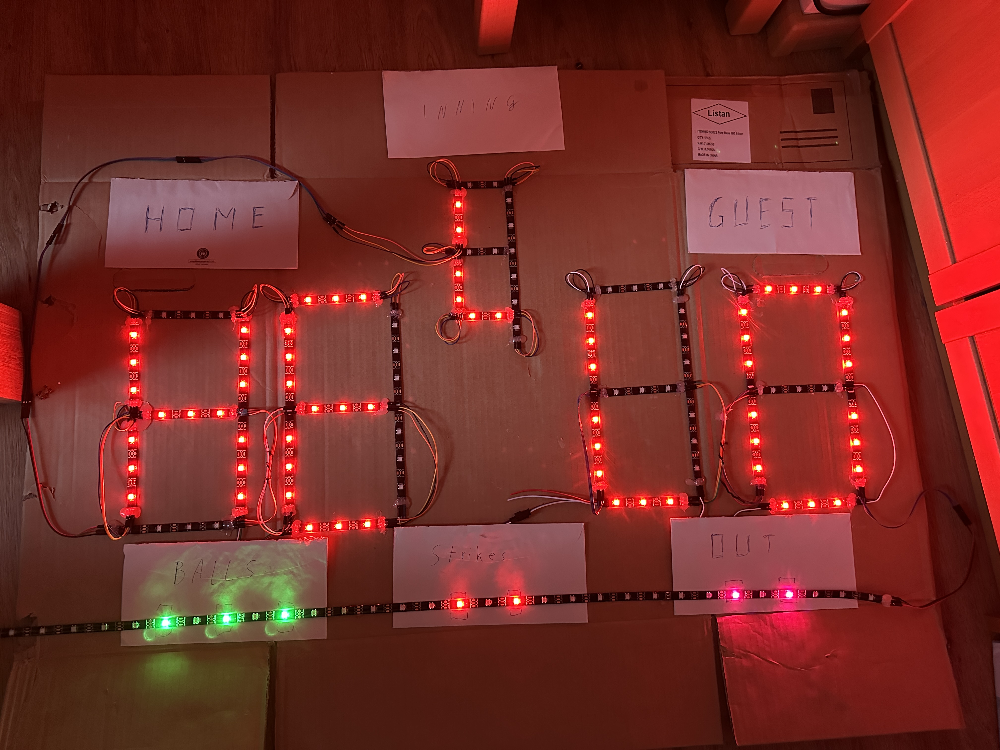

# scoreboard

The pi is powered by a powerbank with 16.000mAh which is enough for more than 4 hours on a normal Raspberry Pi 3.

there is also a [scoreboard-gui](https://github.com/DresdenDukes/scoreboard-gui) for a more user friendly interface.

## hardware

- Pi Zero 2W
- SEZO WS2812B LED stripe IP65 ([Shop](https://www.amazon.de/dp/B0BNN1TXBM))
- Jumper wires ([Shop](https://www.amazon.de/dp/B01EV70C78))

very basic and not accurate wiring


how it looks: 



[Video on YouTube](https://youtu.be/b5tLQOb58DA)


## pi setup

```bash
apt install git python3-pip python3-full
python3 -m venv /opt/pythonenv
/opt/pythonenv/bin/pip install pip --upgrade
/opt/pythonenv/bin/pip install poetry
```

add `/opt/pythonenv/bin:` to PATH in /etc/profile

give pi user access to SPI (Pin19) which is used ad data channel: `usermod -a -G spi -G gpio pi`

due to no real time clock we have to be able to set the time. add this line to `/etc/sudoers` to give the pi user the permission to change the time:
```
pi   ALL=(root) NOPASSWD: /usr/bin/date
```


crontab pi user:
```
@reboot cd /home/pi/examples && /opt/pythonenv/bin/poetry run python segments.py
@reboot sleep 40 && wget -q localhost:7000/clock -O /dev/null
```

## links

here are some helpful links which provided useful information for us:
- https://dordnung.de/raspberrypi-ledstrip/ws2812
- https://github.com/jgarff/rpi_ws281x
- https://youtu.be/Z7xdRMfPbP8
- https://gist.github.com/ysr23/c4a9d7185ed5c6d7ccfa31deead44070
